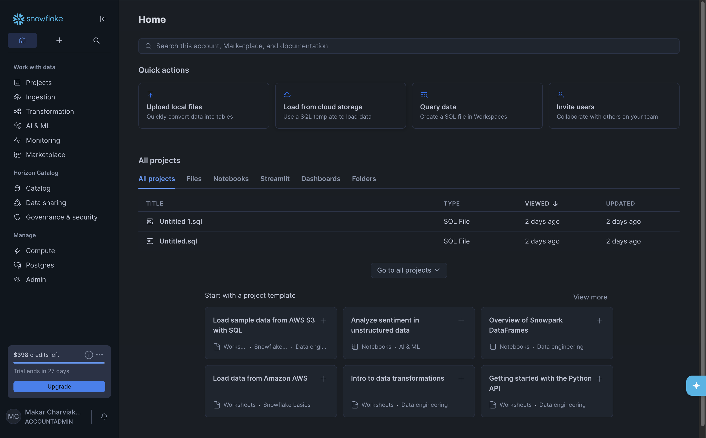
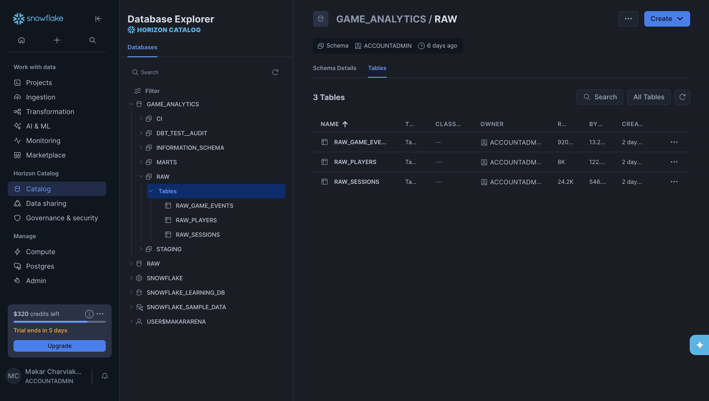
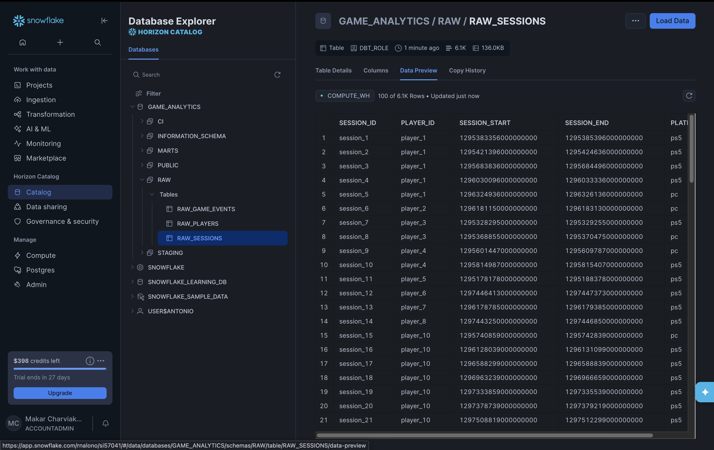
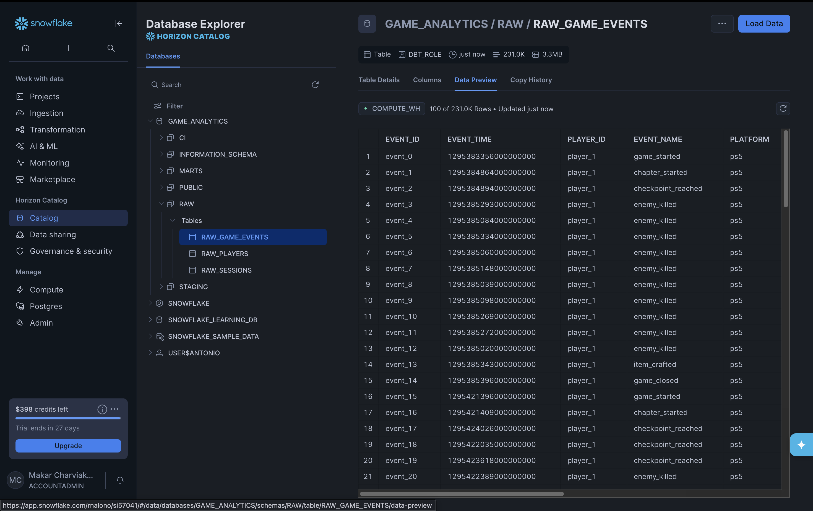
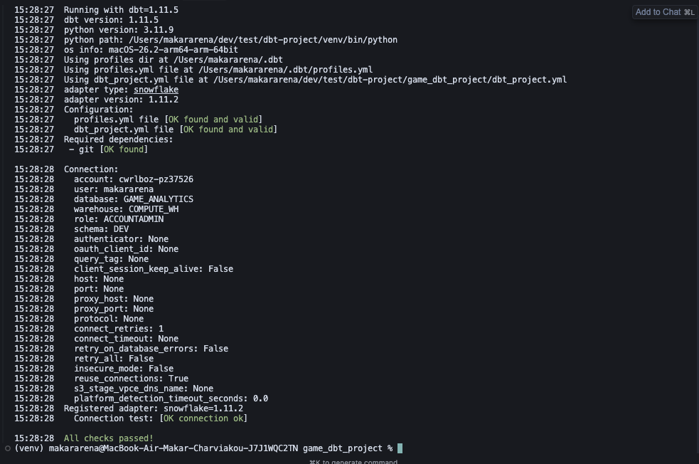

# Game Analytics: Build Your Own Warehouse

A hands-on project to build an analytics warehouse for a narrative game. You run the **game data platform** to generate and load raw data into Snowflake, then build the **dbt project** step by step: raw → staging → marts, macros, and tests. By the end, you’ll have a working pipeline and a clear path from raw events to reporting-ready tables.

---

## The Story


It’s **2012** in Santa Monica. You’re on the team building **The Last of Us** — the story of Joel and Ellie is on the page, the levels are greyboxed, and combat is being tuned week by week. Design keeps asking: *Where do players die the most? Do they come back after the first session? Which chapters get abandoned?* Right now the answer is usually “we’ll check the build and the forums.” You’ve already wired the game to emit events and dump them into pipelines, but there’s no single place to go for “how many players, how many sessions, where they drop.” Someone has to turn that raw firehose into tables the team can actually use. That someone is you.

You’re in a lucky position: unlike the real 2012 stack, you have **modern tools**. **Snowflake** holds the raw data; **dbt** and a proper data platform are on the table. So instead of one-off scripts and spreadsheets, you get to build an **analytics warehouse** the right way — clean, tested, and ready for the questions that will only get louder as the game nears ship.

---

**What you have to work with**

The game is at **MVP**: a few key flows are playable end-to-end, and telemetry is already flowing. You have **three core data frames** (and the pipelines that fill them):

- **Players** — one row per player: country, language, difficulty, first seen, and other attributes. Who they are and how they chose to play.
- **Sessions** — one row per play session. Each player has many sessions; each session has a start time, end time, platform, and duration. *When* and *how long* they play.
- **Events** — one row per in-game event. Events belong to sessions (and thus to players): *game started*, *chapter started*, *checkpoint reached*, *enemy killed*, *player died*, *item crafted*, *chapter completed*, *game closed*. Payloads can include chapter names, locations, weather, enemy names, weapon names, crafting materials — the stuff design will use to balance difficulty and fix friction.

The hierarchy is simple: **player → sessions → events**. Your job is to turn that into a warehouse: define sources, stage and clean the data, build dimensions and facts (dim_players, fct_sessions, fct_game_events), add analytics marts (DAU, funnel, retention), and harden everything with tests and CI. When you’re done, the team can stop guessing and start answering — and you’ll have done it step by step, by following the tasks below. No prior dbt experience required.

### Schema hierarchy (entities and relationships)

There are **three entities**; all relationships are **one-to-many**:

| Entity   | Raw table        | Grain              | Relationship                          |
|----------|------------------|--------------------|---------------------------------------|
| **Player**  | `RAW_PLAYERS`    | One row per player | One player has **many** sessions      |
| **Session** | `RAW_SESSIONS`   | One row per session| One session has **many** events       |
| **Event**   | `RAW_GAME_EVENTS`| One row per event  | Belongs to exactly one session (and thus one player) |

```
┌─────────────┐      1:N      ┌─────────────┐      1:N      ┌─────────────┐
│   PLAYER    │──────────────>│   SESSION   │──────────────>│    EVENT    │
├─────────────┤               ├─────────────┤               ├─────────────┤
│ player_id   │               │ session_id  │               │ event_id    │
│ first_seen  │               │ player_id   │               │ session_id  │
│ country     │               │ start/end   │               │ player_id   │
│ language    │               │ platform    │               │ event_name  │
│ difficulty  │               │             │               │ event_at    │
└─────────────┘               └─────────────┘               │ properties  │
                                                            └─────────────┘
```

In short: **Player 1 → N Sessions → N Events**. Events are tied to a session via `session_id` (and to a player via `player_id`); sessions are tied to a player via `player_id`.

### Unique values (reference data)

The synthetic pipeline uses fixed sets of values. Useful for dbt `accepted_values` tests and for understanding the data:

| Field          | Table(s)        | Unique values |
|----------------|-----------------|---------------|
| **country**    | `RAW_PLAYERS`   | `US`, `PL`, `DE`, `FR`, `ES`, `BY` |
| **language**   | `RAW_PLAYERS`   | `en`, `pl`, `de`, `fr`, `es`, `be` |
| **difficulty_selected** | `RAW_PLAYERS` | `easy`, `normal`, `hard`, `grounded` |
| **platform**   | `RAW_SESSIONS`, `RAW_GAME_EVENTS` | `ps3`, `xbox360`, `pc` |
| **event_name** | `RAW_GAME_EVENTS` | `game_started`, `chapter_started`, `checkpoint_reached`, `enemy_killed`, `player_died`, `item_crafted`, `chapter_completed`, `game_closed` |

**properties** (in `RAW_GAME_EVENTS`) is a JSON/VARIANT; not every event has every key. Possible keys and example values:

- **chapter_name**: e.g. `The Outskirts`, `The Quarantine Zone`, `Downtown`, `The Suburbs`, `The University`, `The Hospital`, `The Financial District`, `The Docks`, `The Bridge`, `The Firefly Lab`
- **location**: e.g. `abandoned_building`, `street`, `sewer`, `rooftop`, `warehouse`, `park`, `subway`, `apartment`, `mall`, `school`
- **weather**: `clear`, `rain`, `fog`, `snow`
- **enemy_name**: e.g. `runner`, `clicker`, `bloater`, `stalker`, `shambler`, `hunter`, `soldier`, `scavenger`, `bandit`, `merchant`
- **weapon_name**: e.g. `9mm_pistol`, `revolver`, `hunting_rifle`, `assault_rifle`, `hunting_bow`, `compound_bow`
- **crafting_materials**: e.g. `alcohol`, `rag`, `scissors`, `bottle`, `tape`, `blade` (used for medkit, molotov, shiv)

---

## Project Outline

| Layer / Area   | What you build |
|----------------|----------------|
| **Data in**    | Run `game-data-platform`: generate data → load to Snowflake. |
| **Raw**        | dbt **sources**: `raw_players`, `raw_sessions`, `raw_game_events` (schema, columns, optional source tests). |
| **Staging**    | dbt **models**: `stg_players`, `stg_sessions`, `stg_game_events` — clean, standardize names and types. |
| **Core marts** | `dim_players`, `fct_sessions`, `fct_game_events` — dimensions and facts for analysis. |
| **Analytics marts** | `daily_active_players`, `funnel_sessions`, `retention` — reporting-ready aggregates. |
| **Macros**     | `generate_schema_name` for environment-specific schemas. |
| **Tests**      | Column tests (not null, unique, relationships) + at least one singular test (e.g. sessions don’t overlap). |
| **CI**         | GitHub Action: `dbt compile` and optionally `dbt build` so broken contracts fail the pipeline. |

 ---
 
## dbt commands we are gonna use and what they mean

This project uses a small set of `dbt` commands during development and in CI. Below is what each command does, when to run it, and a short example.

- **`dbt deps`**: Installs packages listed in `packages.yml` into the local `dbt_modules/` folder. Run this after cloning the repo or when `packages.yml` changes.

```bash
dbt deps
```

- **`dbt compile`**: Renders Jinja and SQL for all models, macros, and tests, and writes the compiled SQL to `target/compiled/`. Useful to quickly validate templating and macros without executing queries. In CI we run `dbt compile --target ci` to ensure the project compiles under the CI profile.

```bash
dbt compile
dbt compile --target ci
```

- **`dbt build`**: The all-in-one command that runs `dbt run` (models), `dbt test` (schema & data tests), `dbt seed`, and `dbt snapshot` in the proper dependency order. Use this to execute models and tests together; CI uses `dbt build --target ci` so failing tests or models break the pipeline.

```bash
dbt build
dbt build --target ci
```

- **`dbt run`**: Executes model SQL to create/update objects in the target database/schema. Use this locally when you only want to materialize models (not tests).

```bash
dbt run
```

- **`dbt test`**: Runs schema tests and any singular tests defined in `tests/` (e.g. `sessions_no_overlap.sql`). Use this to validate data quality after model runs, or run tests independently in CI if preferred.

```bash
dbt test
```

- **`dbt debug`**: Checks the active `profiles.yml`, confirms connection to the data warehouse, and validates the environment. Useful when setting up a new profile or troubleshooting CI credentials.

```bash
dbt debug
```

- **`dbt docs generate` / `dbt docs serve`**: Builds the documentation site (`target/catalog.json`, `manifest.json`) and serves it locally. Helpful for exploring model lineage and column descriptions.

```bash
dbt docs generate
dbt docs serve
```

Notes:
- In CI we prefer `dbt compile --target ci` to detect compilation issues early and `dbt build --target ci` to run models + tests and fail the job on error.
- Use `--select` / `--exclude` flags to target subsets of models (e.g., `dbt build --select marts+`).
- Keep secrets out of source: the workflow expects a `SNOWFLAKE_CI_PROFILE` secret that writes `~/.dbt/profiles.yml` during the run.

 
 ## Tasks

Do the tasks in order. Each task is a single, clear step from start to finish.

---

### Phase 0: Get data and set up dbt

- [ ] **0.1** **Snowflake account setup** — follow [Snowflake account setup](instructions/snowflake-account-setup.md).
- [ ] **0.2** **Pre-launch setup** — create database and schemas in Snowflake. See [Pre-launch setup](instructions/pre-launch-setup.md): choose **Path 1** (minimal: database + schemas only) or **Path 2** (production-style: warehouse + database + role + schemas, including `ALTER USER ... SET DEFAULT_ROLE = DBT_ROLE`).
- [ ] **0.3** **Snowflake credentials** — see [Snowflake credentials](instructions/snowflake-credentials.md) for how to find your account identifier, user, warehouse, database, and schema.
- [ ] **0.4** **Run the platform** — from the repo root run `chmod +x run_platform.sh` (first time only), then `./run_platform.sh` to generate synthetic data and load `RAW_PLAYERS`, `RAW_SESSIONS`, `RAW_GAME_EVENTS` into Snowflake.
- [ ] **0.5** **Set up dbt** — follow [dbt setup](instructions/dbt-setup.md): create your dbt project, `~/.dbt/profiles.yml` (profile `game_analytics` or as in the doc), and run `dbt deps`.

<details>
<summary>Check yourself (Phase 0)</summary>

Verify each of the following:

1. **Snowflake account access** — You can log in and see your account (e.g. trial credits, ACCOUNTADMIN role).  
   

2. **Database, schemas, and tables in the catalog** — In Snowflake’s Database Explorer (Horizon Catalog), the `GAME_ANALYTICS` database and its schemas are visible; under the `RAW` schema you see the three tables: `RAW_GAME_EVENTS`, `RAW_PLAYERS`, `RAW_SESSIONS`.  
   

3. **Data preview** — In Snowflake's Database Explorer, open each raw table and go to the **Data Preview** tab. You should see sample rows in each table. Use this to confirm data was loaded correctly. Reference screenshots:
   - **RAW_PLAYERS** (e.g. ~2K rows: player_id, first_seen_at, country, language, difficulty_selected)  
     
   - **RAW_SESSIONS** (e.g. ~6K rows: session_id, player_id, session_start, session_end, platform)  
     
   - **RAW_GAME_EVENTS** (e.g. ~231K rows: event_id, event_time, player_id, event_name, platform)  
     

4. **dbt project and venv in parent directory** — One level up from `game-data-platform` you have your dbt project folder (created by `dbt init`) and a `venv` for dbt. You run dbt from the project folder with the venv activated.

5. **dbt debug passes** — From your dbt project directory, run `dbt debug`. The output shows all checks passed (connection, profile, and project config).  
   

</details>

### Phase 1: Raw layer (sources)

⬜⬜⬜⬜⬜⬜⬜⬜⬜⬜ 0%

**Instructions:** [Phase 1 — Task](instructions/phases/phase1/phase1-raw-sources.md) · [Phase 1 — Check yourself](instructions/phases/phase1/phase1-raw-sources-check-yourself.md)

---

### Phase 2: Macros and multi-schema support

🟩⬜⬜⬜⬜⬜⬜⬜⬜⬜ 10%

**Instructions:** [Phase 2 — Task](instructions/phases/phase2/phase2-macros-schemas.md) · [Phase 2 — Check yourself](instructions/phases/phase2/phase2-macros-schemas-check-yourself.md)

---

### Phase 3: Staging layer

🟩🟩⬜⬜⬜⬜⬜⬜⬜⬜ 20%

**Instructions:** [Phase 3 — Task](instructions/phases/phase3/phase3-staging.md) · [Phase 3 — Check yourself](instructions/phases/phase3/phase3-staging-check-yourself.md)

---

### Phase 4: Core marts

🟩🟩🟩⬜⬜⬜⬜⬜⬜⬜ 30%

**Instructions:** [Phase 4 — Task](instructions/phases/phase4/phase4-core-marts.md) · [Phase 4 — Check yourself](instructions/phases/phase4/phase4-core-marts-check-yourself.md)

---

### Phase 5: Analytics marts

🟩🟩🟩🟩⬜⬜⬜⬜⬜⬜ 40%

**Instructions:** [Phase 5 — Task](instructions/phases/phase5/phase5-analytics-marts.md) · [Phase 5 — Check yourself](instructions/phases/phase5/phase5-analytics-marts-check-yourself.md)

---

### Phase 6: Tests and quality

🟩🟩🟩🟩🟩⬜⬜⬜⬜⬜ 50%

**Instructions:** [Phase 6 — Task](instructions/phases/phase6/phase6-tests-quality.md) · [Phase 6 — Check yourself](instructions/phases/phase6/phase6-tests-quality-check-yourself.md)

---

### Phase 7: CI

🟩🟩🟩🟩🟩🟩⬜⬜⬜⬜ 60%

**Instructions:** [Phase 7 — Task](instructions/phases/phase7/phase7-ci.md) · [Phase 7 — Check yourself](instructions/phases/phase7/phase7-ci-check-yourself.md)

---

### Phase 8 (Advanced): Incremental `fct_game_events` + `fct_sessions`

🟩🟩🟩🟩🟩🟩🟩⬜⬜⬜ 70%

**Instructions:** [Phase 8 — Task](instructions/phases/phase8/phase8-incremental-fct-game-events.md) · [Phase 8 — Check yourself](instructions/phases/phase8/phase8-incremental-fct-game-events-check-yourself.md)

---

## 🏁 Final Boss: Product Questions You Must Be Able to Answer

🟩🟩🟩🟩🟩🟩🟩🟩🟩🟩 100%


You didn't build a warehouse to admire clean models. You built it to answer hard product questions.

After completing all phases (sources → macros/schemas → staging → marts → tests → CI), your final task is to answer the questions below **using only your dbt models**:

- `dim_players`
- `fct_sessions`
- `fct_game_events`
- `daily_active_players`
- `funnel_sessions`
- `retention`

If you can answer these — your warehouse is working.

### 1. Retention & Player Return

1. What are **D1, D3, and D7 retention rates**?
2. Which **countries** have the lowest retention?
3. Does retention differ by **difficulty_selected**?
4. What % of players have **only one session**?
5. What % of players return for a **second session**?

Goal: understand whether players come back — and who does not.

<details>
<summary>Check yourself — 1. Retention & Player Return</summary>

- **Q1 – D1/D3/D7 retention**: use the `retention` model; filter `days_since_cohort IN (1, 3, 7)` and read `retention_rate_pct` for those days (optionally averaging across cohorts).
- **Q2 – Countries with lowest retention**: from `retention`, group by `country_code` and a chosen `days_since_cohort` (e.g. 1 or 7), order by `retention_rate_pct` ascending.
- **Q3 – Retention by difficulty**: same `retention` model, grouped by `difficulty_selected` and `days_since_cohort`.
- **Q4 – % of players with only one session**: from `dim_players`, compute `count(*) WHERE total_sessions = 1` divided by `count(*)` overall.
- **Q5 – % of players returning for a second session**: from `dim_players`, compute `count(*) WHERE total_sessions >= 2` divided by `count(*)` overall.

</details>

### 2. Drop-Off & Friction

6. At which step of the session funnel do players drop the most?
7. What % of sessions never reach a **checkpoint**?
8. What % of sessions start a chapter but never complete one?
9. Are there sessions with **high deaths but low progression**?

Goal: identify friction points in the core loop.

<details>
<summary>Check yourself — 2. Drop-Off & Friction</summary>

- **Q6 – Funnel step with biggest drop**: use `funnel_sessions`; compare `sessions_with_*` columns vs `total_sessions` for each step to see where conversion rate is lowest.
- **Q7 – % of sessions without a checkpoint**: in `funnel_sessions`, compute `1 - sessions_with_checkpoint_reached / total_sessions` for your chosen date range.
- **Q8 – Sessions that start a chapter but never complete one**: from `funnel_sessions`, compare `sessions_with_chapter_started` vs `sessions_with_chapter_completed` and compute the difference / `total_sessions`.
- **Q9 – High deaths, low progression sessions**: query `fct_sessions` filtering for `deaths_count` above a threshold and `chapters_completed = 0` (or very low), optionally grouping by chapter or difficulty to locate problem areas.

</details>

### 3. Difficulty & Balance

10. Which difficulty has the highest **death rate per session**?
11. Do players on higher difficulty churn faster?
12. Which chapters have the lowest completion rates?
13. Is there a relationship between **session duration** and **chapter completion**?

Goal: detect balance issues before ship.

<details>
<summary>Check yourself — 3. Difficulty & Balance</summary>

- **Q10 – Difficulty with highest death rate per session**: from `fct_sessions`, group by `difficulty_selected` and compute `sum(deaths_count) / count(*)` (or average `deaths_count`).
- **Q11 – Do higher difficulties churn faster?**: from `retention`, group by `difficulty_selected` and `days_since_cohort` (e.g. day 1 / 7) and compare `retention_rate_pct` across difficulties.
- **Q12 – Chapters with lowest completion**: use `fct_game_events` (or staging events) to compare counts of `chapter_started` vs `chapter_completed` by `chapter_id` / `chapter_name` and compute completion rate.
- **Q13 – Session duration vs chapter completion**: from `fct_sessions`, bucket `session_duration_minutes` (short/medium/long) and compute `chapters_completed` or completion rate per bucket to see the relationship.

</details>

### 4. Session Behavior

14. What is the **median session duration**?
15. Are longer sessions correlated with higher retention?
16. What is the average **events_per_minute**?
17. Are there sessions with zero or unusually low event activity?

Goal: understand how players actually play.

<details>
<summary>Check yourself — 4. Session Behavior</summary>

- **Q14 – Median session duration**: read `median(session_duration_minutes)` (or approximate with `percentile_cont(0.5)`) from `fct_sessions`.
- **Q15 – Longer sessions vs retention**: aggregate `fct_sessions` to player level (e.g. average `session_duration_minutes` per player), join to `retention` or cohort info, and compare retention metrics across duration buckets.
- **Q16 – Average events_per_minute**: from `fct_sessions`, take `avg(events_per_minute)` (optionally by difficulty, platform, or country).
- **Q17 – Low-activity sessions**: filter `fct_sessions` where `events_per_minute` is near zero or `total_events = 0` to find idle/buggy sessions.

</details>

### 5. Segmentation

18. Define a "core player" (e.g. ≥5 sessions, ≥120 minutes playtime, ≥1 chapter completed).

- How many core players exist?
- From which countries?
- On which difficulty?

19. Define "one-and-done" players (1 session, no chapter completed).

- What % of total players are they?
- Do they cluster by country or difficulty?

Goal: separate your engaged audience from early churn.

<details>
<summary>Check yourself — 5. Segmentation</summary>

- **Q18 – Core players**: in `dim_players`, define a core player as `total_sessions >= 5`, `total_playtime_minutes >= 120`, and `chapters_completed >= 1` (if you add that metric); count them and slice by `country_code` and `difficulty_selected`.
- **Q19 – One-and-done players**: from `dim_players`, filter `total_sessions = 1` and (optionally) zero progression; compute their share of all players and break down by country and difficulty to see where early churn concentrates.

</details>

### Completion Criteria

You have successfully completed the project if:

- You can answer these questions using only warehouse models.
- You can explain *how* each answer is derived.
- Your models pass all tests.
- Your CI pipeline fails when contracts break.
- You can identify at least one actionable product insight.

At that point, you are no longer "building tables." You are running a game analytics platform.
