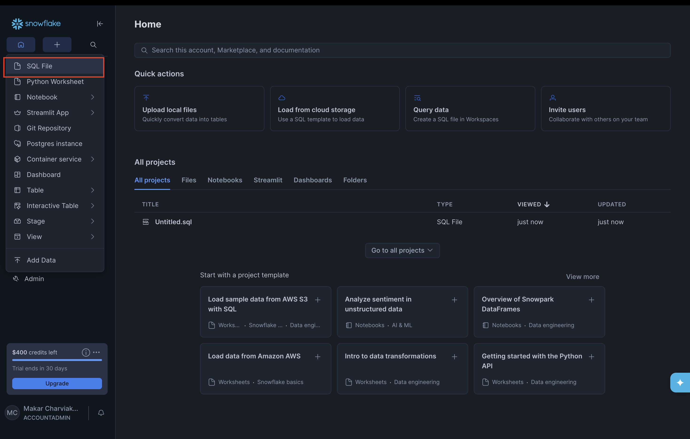
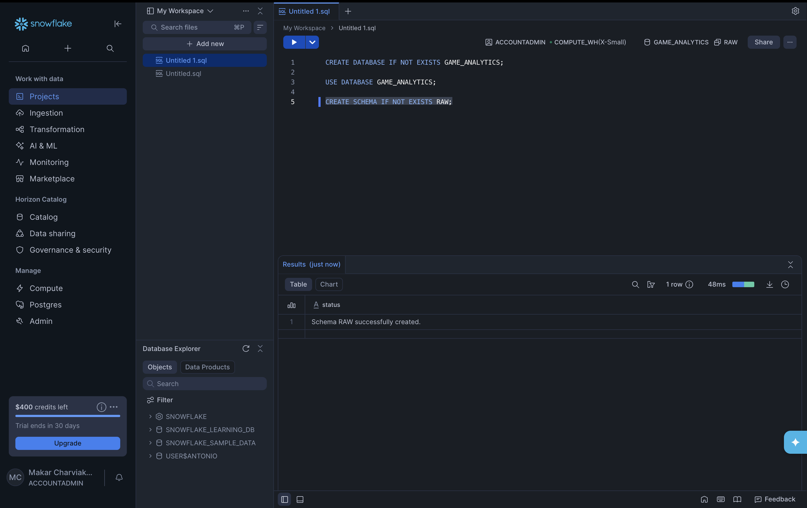

# Pre-launch setup: database and schema in Snowflake

Before you run `run_platform.sh`, you need a **database** and a **schema** in Snowflake where the raw tables will live. Use the **Compute** page (or any warehouse you already have) — you don’t need to create or choose a warehouse; just use the one Snowflake gives you and write its name in your `.env` later.

<details>
<summary><strong>What is a warehouse?</strong></summary>

A **warehouse** in Snowflake is the compute resource that runs your queries and loads. It’s like a “server” that Snowflake spins up when you run SQL or load data. You don’t create tables inside it — you just pick one (e.g. `COMPUTE_WH`) and Snowflake uses it to do the work. Trial accounts usually have one already; you only need its name for `.env`.
</details>

<details>
<summary><strong>What is a database?</strong></summary>

A **database** is a top-level container for your data. Think of it as a folder that holds schemas and tables. For this course we use one database (e.g. `GAME_ANALYTICS`) to keep all game analytics objects in one place.
</details>

<details>
<summary><strong>What is a schema?</strong></summary>

A **schema** lives inside a database and groups related tables. It’s like a subfolder. We use several schemas: `RAW` (where the platform loads CSV data), `STAGING` and `MARTS` (where dbt builds staging views and mart tables), and `CI` (where dbt runs in the CI pipeline). Each keeps a layer of the warehouse separate so you can manage permissions and environments cleanly.
</details>

<details>
<summary><strong>What are the tables?</strong></summary>

**Tables** are where the actual rows of data live. In this project, the pipeline creates three raw tables: `RAW_PLAYERS`, `RAW_SESSIONS`, and `RAW_GAME_EVENTS`. They sit in your database and schema (e.g. `GAME_ANALYTICS.RAW.RAW_PLAYERS`). You then use dbt to build more tables (staging, marts) on top of these.
</details>

<details>
<summary><strong>What is the <code>run_platform.sh</code> script?</strong></summary>

**run_platform.sh** is a bootstrap script in the project root. When you run it, it asks for your Snowflake credentials (or reuses them from `.env`), writes them into `app/.env`, sets up a Python environment, generates synthetic game data (players, sessions, events), and loads that data into your Snowflake raw tables. It’s the main way to get data into Snowflake for this course.
</details>

---

## Where to run SQL in Snowflake

1. In the Snowflake web UI, open the left-hand menu and click **SQL File** (under the + icon) to create a new SQL worksheet.



2. You’ll get a worksheet where you can paste and run the commands below. Use the **Run** button (play icon) to execute them. At the top you’ll see your current context: role, warehouse (e.g. `COMPUTE_WH`), database, and schema — that’s the warehouse name you’ll put in `.env`.



---

## SQL to run (and what each command does)

Paste this into your SQL worksheet and run it:

```sql
CREATE DATABASE IF NOT EXISTS GAME_ANALYTICS;

USE DATABASE GAME_ANALYTICS;

CREATE SCHEMA IF NOT EXISTS RAW;
CREATE SCHEMA IF NOT EXISTS STAGING;
CREATE SCHEMA IF NOT EXISTS MARTS;
CREATE SCHEMA IF NOT EXISTS CI;
```

**Why we need these schemas**

- **RAW** — The platform loads CSV data here. dbt only reads from RAW; it never writes to it, so raw data stays stable.
- **STAGING** — dbt builds staging models (cleaned views) here. Separating staging from raw and marts keeps layers clear and lets you refresh or permission them independently.
- **MARTS** — dbt builds dimensions, facts, and analytics tables here. This is the reporting-ready layer; keeping it in its own schema lets analysts and tools use only marts.
- **CI** — The CI pipeline (e.g. GitHub Actions) runs dbt in this schema so runs don’t overwrite dev or marts and you can validate changes before merging.

**What each line does:**

- **`CREATE DATABASE IF NOT EXISTS GAME_ANALYTICS;`**  
  Creates a database named `GAME_ANALYTICS` for this course. If it already exists, nothing happens. This is just a container for your tables.

- **`USE DATABASE GAME_ANALYTICS;`**  
  Switches the rest of the commands to use that database, so the next command runs inside it.

- **`CREATE SCHEMA IF NOT EXISTS RAW;`**  
  Creates the schema where the platform loads raw tables (`RAW_PLAYERS`, `RAW_SESSIONS`, `RAW_GAME_EVENTS`). Raw data stays here and is never overwritten by dbt.

- **`CREATE SCHEMA IF NOT EXISTS STAGING;`**  
  Creates the schema where dbt will build your **staging models** (cleaned, typed views like `stg_players`, `stg_sessions`, `stg_game_events`). Keeping staging in its own schema separates “cleaned raw” from raw and from marts, and makes it easy to grant access or refresh only this layer.

- **`CREATE SCHEMA IF NOT EXISTS MARTS;`**  
  Creates the schema where dbt will build your **marts** (dimensions, facts, and analytics tables like `dim_players`, `fct_sessions`, `daily_active_players`). This is the reporting-ready layer; keeping it in a dedicated schema lets analysts and tools query only marts without touching staging or raw.

- **`CREATE SCHEMA IF NOT EXISTS CI;`**  
  Creates a schema used by the **CI pipeline** (e.g. GitHub Actions) when it runs `dbt build`. CI runs in an isolated schema so they don’t overwrite your dev or marts, and you can validate that models and tests pass before merging code.

---

## Write these values in your `.env` file

After the commands run successfully, note:

1. The **warehouse** name shown at the top of the worksheet (e.g. `COMPUTE_WH`) — use the Compute page or any warehouse you have; no need to create one.
2. The **database** you created: `GAME_ANALYTICS`.
3. The **schema** you created: `RAW`.

Put them in `game-data-platform/app/.env` (together with your user, password, and account from the credentials step):

```env
SNOWFLAKE_USER=your_username
SNOWFLAKE_PASSWORD=your_password
SNOWFLAKE_ACCOUNT=your_account
SNOWFLAKE_WAREHOUSE=COMPUTE_WH
SNOWFLAKE_DATABASE=GAME_ANALYTICS
SNOWFLAKE_SCHEMA=RAW
```

Replace `COMPUTE_WH` with the warehouse name you see in the worksheet if it’s different.

---

## 5. Check before first run

Before you run:

```bash
./run_platform.sh
```

make sure:

1. You can log into Snowflake with your **user** and **password**.
2. The SQL above has been run (database `GAME_ANALYTICS` and schema `RAW` exist).
3. Your `app/.env` has all six variables above filled in (user, password, account, warehouse, database, schema).

Then the script will generate the CSVs and load them into `GAME_ANALYTICS.RAW` as `RAW_PLAYERS`, `RAW_SESSIONS`, and `RAW_GAME_EVENTS`.
