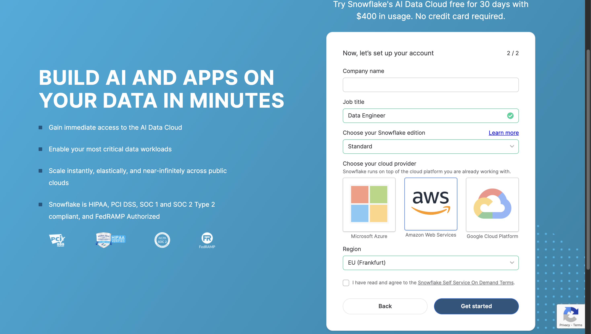
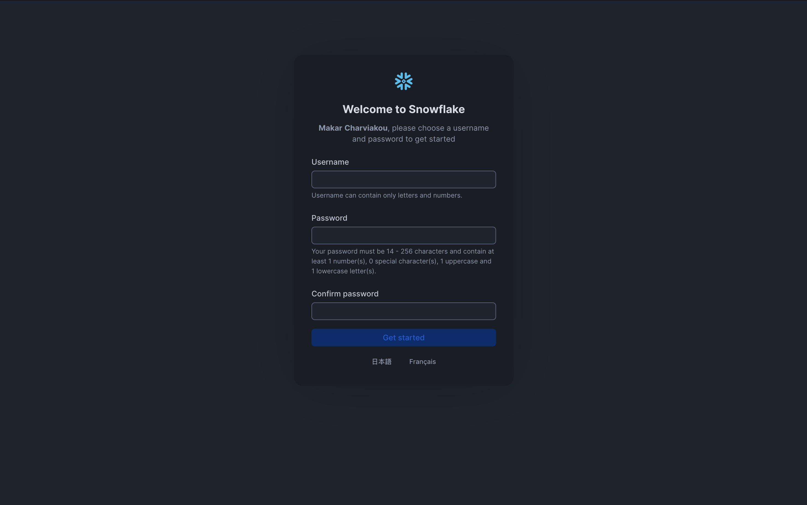

# Snowflake account setup (5 steps)

Follow these steps to create a Snowflake account for this project. You will need your **username** and **password** later for the other instructions (credentials and dbt profile).

> **Tip:** YouTube has many step-by-step videos for setting up a Snowflake account. If the screens below look different on your side, search for something like “Snowflake free trial sign up” and **pick the most recent video** — the UI changes over time, and following an up-to-date walkthrough can be easier than written steps alone.

---

## Step 1: Open the sign-up page

1. Go to **[https://www.snowflake.com/en/](https://www.snowflake.com/en/)**.
2. Click **Start for free** (or equivalent sign-up link).

---

## Step 2: Fill in your details (first screen)

On the first sign-up screen:

1. Enter your **first name** and **last name**.
2. Enter your **work email** or any other email you use.
3. Choose the **reason** you are signing up (e.g. “Try Snowflake”, “Evaluate”, etc.).
4. Tick the **agreement / terms** checkbox.
5. Click **Continue**.

---

## Step 3: Choose cloud, region, and edition (second screen)

On the next screen:

1. Enter your **company name** and **job title**.
2. Choose where to run Snowflake:
   - **Microsoft Azure**, or  
   - **Amazon Web Services**, or  
   - **Google Cloud Platform**
3. Choose a **region** (e.g. one close to you).
4. Choose the **Snowflake edition** — for this project, **Standard** is enough.
5. Click **Continue**.

---

## Step 4: Check your inbox

1. Wait for the **email** from Snowflake to arrive in your inbox.
2. Open it and use the link (or instructions) to **activate your account** and continue to the setup page.

---

## Step 5: Set your username and password

1. In the setup window, choose your **username**.
2. Set your **password** and **confirm** it (type it again).
3. **Write down your username and password** somewhere safe — you will need them for:
   - `app/.env` (Snowflake credentials)
   - Your dbt profile (`~/.dbt/profiles.yml`)

See the other instructions in this folder for where to put these values.

---

## After you have an account

- **Account identifier**: You will see it in the Snowflake URL (e.g. `xy12345.eu-central-1`) or in the UI. Use it as `SNOWFLAKE_ACCOUNT` in `.env`.
- **Warehouse**: Use the default warehouse name (e.g. `COMPUTE_WH`) or one assigned to you — that is `SNOWFLAKE_WAREHOUSE`.
- **Database and schema**: Create them (or use existing ones) as described in **pre-launch-setup.md**; then set `SNOWFLAKE_DATABASE` and `SNOWFLAKE_SCHEMA` in `.env`.

For the exact variable names and file format, see **snowflake-credentials.md**.
