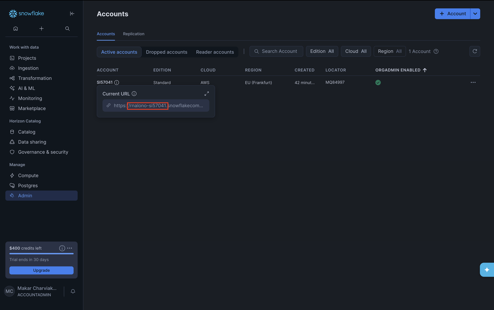

# Snowflake credentials

**Do the instructions in this order:**  
1. [Snowflake account setup](snowflake-account-setup.md) → 2. [Pre-launch setup](pre-launch-setup.md) → 3. This doc (credentials) → 4. [dbt setup](dbt-setup.md) (create your dbt project and get started).

---

<summary><strong>Where do I find my account identifier (account name)?</strong></summary>

1. In the Snowflake web UI, open **Admin** in the left menu, then click **Accounts**.
2. On the Accounts page, find your account in the table. Under it you’ll see **Current URL** with a link (e.g. `https://rnalono-si57041.snowflakecomputing.com/...`).
3. The **account name** is everything between `https://` and `.snowflake` in that URL.  
   Example: from `https://rnalono-si57041.snowflakecomputing.com/...` the account name is **`rnalono-si57041`**.  
   Use this value for `SNOWFLAKE_ACCOUNT` in your `.env`.




---

## 1. Credentials you need

| Variable | What it is |
|----------|------------|
| `SNOWFLAKE_USER` | Your Snowflake login |
| `SNOWFLAKE_PASSWORD` | Your Snowflake password |
| `SNOWFLAKE_ACCOUNT` | Account identifier (e.g. `rnalono-si57041`; see the URL or signup email) |
| `SNOWFLAKE_WAREHOUSE` | Warehouse name (e.g. `COMPUTE_WH`) |
| `SNOWFLAKE_DATABASE` | Database for this course (e.g. `GAME_ANALYTICS`) |
| `SNOWFLAKE_SCHEMA` | Schema for raw tables (e.g. `RAW`) |

If you have a course-provided account, your instructor will give you these values.

---

## 2. Put them in `app/.env`

Create or edit `game-data-platform/app/.env`:

```env
SNOWFLAKE_USER=your_username
SNOWFLAKE_PASSWORD=your_password
SNOWFLAKE_ACCOUNT=your_account
SNOWFLAKE_WAREHOUSE=COMPUTE_WH
SNOWFLAKE_DATABASE=GAME_ANALYTICS
SNOWFLAKE_SCHEMA=RAW
```

- No spaces around `=`. Plain values (quotes optional).
- Optional: same variables in `game-data-platform/.env`; the script uses them as defaults.

---

## 3. Or use `run_platform.sh` to fill `.env`

From the repo root (`game-data-platform/`):

```bash
chmod +x run_platform.sh   # one time
./run_platform.sh
```

The script prompts for each value (reusing existing ones from `.env` if present), writes `app/.env`, then sets up the environment, generates data, and loads it into Snowflake. After it finishes, your raw tables are in `GAME_ANALYTICS.RAW` (or your chosen database/schema).

---

## 4. dbt profile

Your dbt profile (`~/.dbt/profiles.yml`) uses the same connection: map `account`, `user`, `password`, `warehouse`, `database` from the variables above. Use a **different schema** for dbt models (e.g. `DEV`), not `RAW` — the pipeline writes raw tables into `RAW`; dbt reads them as sources and builds into `DEV` (or `MARTS`).

---

## 5. Security

- **Do not commit `.env`** (it contains your password). The repo `.gitignore` should exclude it; check before pushing.
- Don’t paste `.env` or credentials into screenshots or public repos. If leaked, rotate your Snowflake password.
